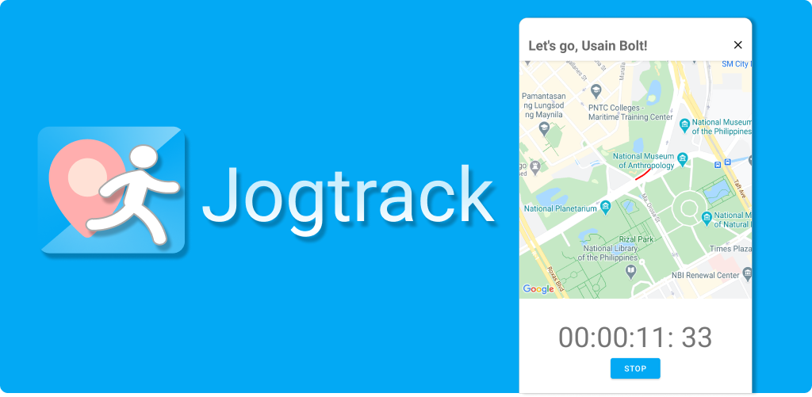
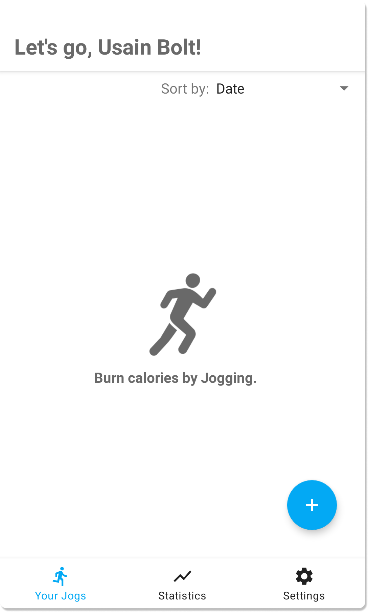
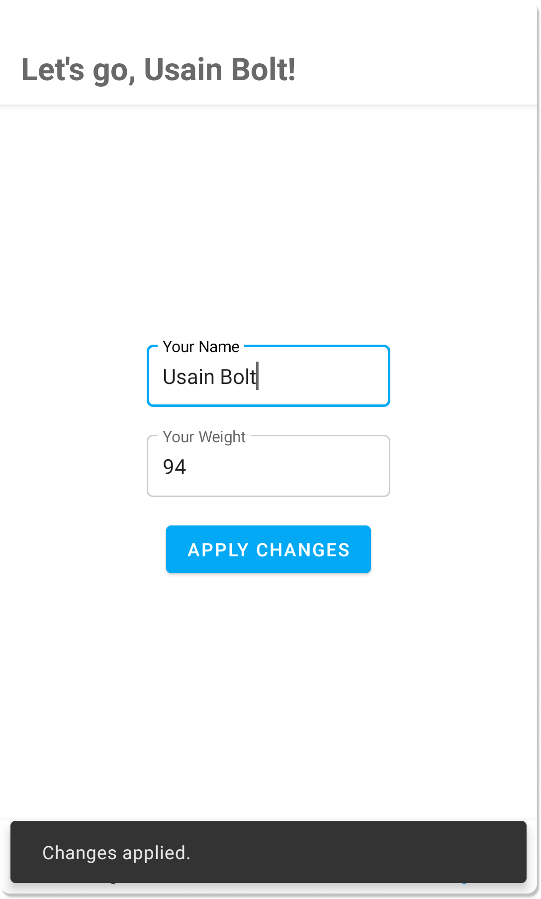
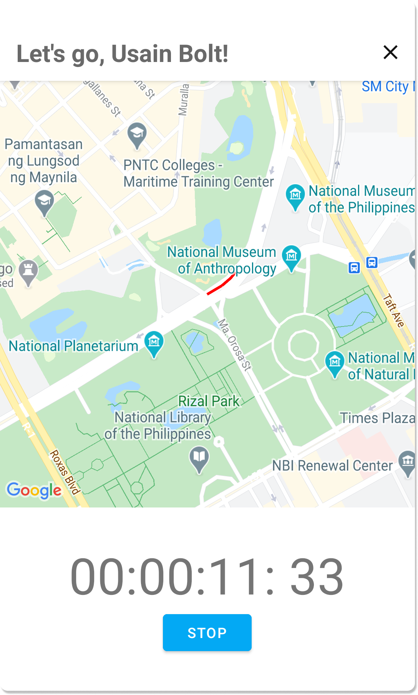
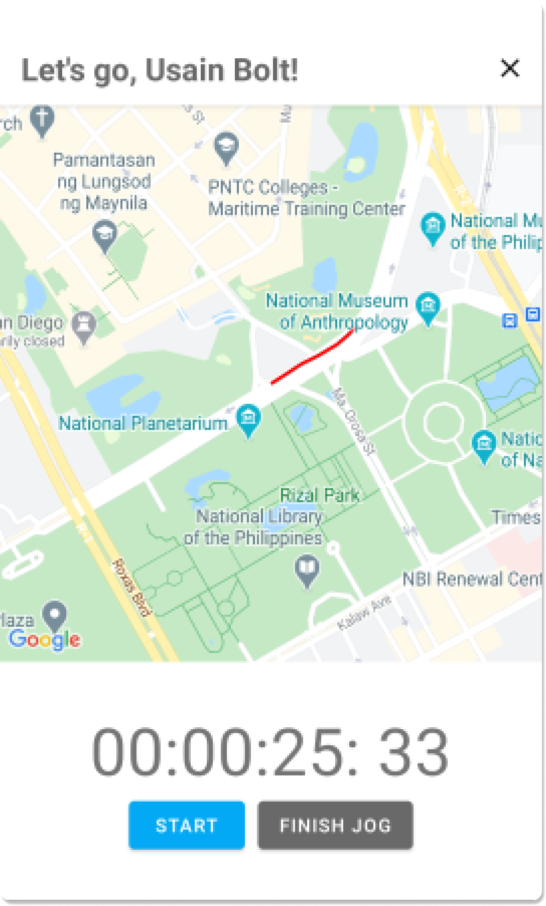
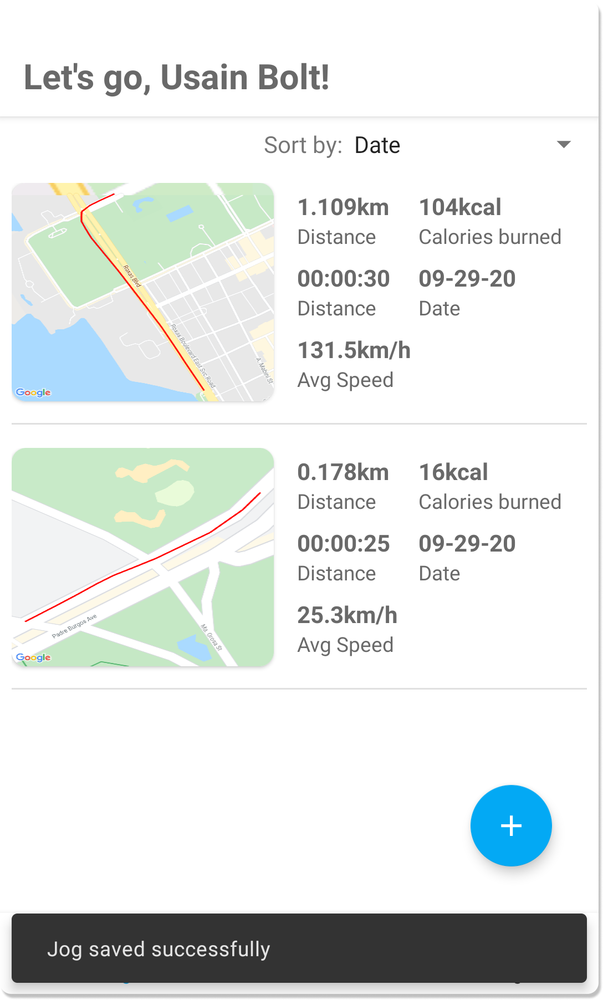
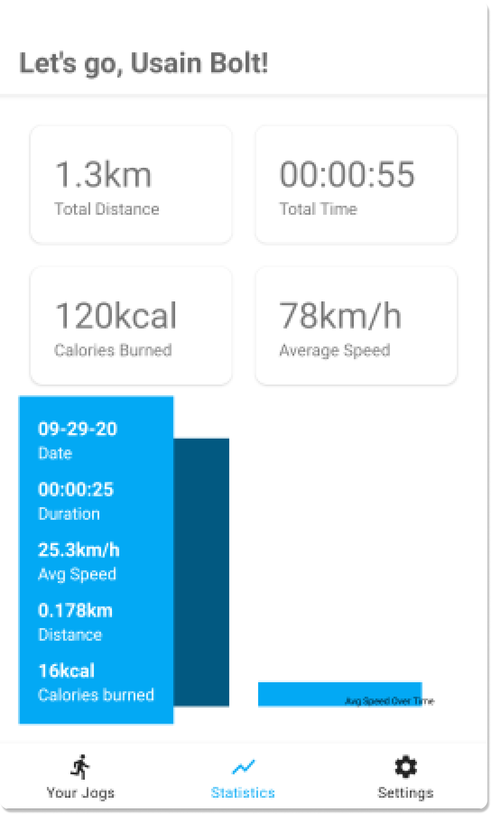

# Jogtrack
### Simple jogging tracker for Android which uses the google maps api for tracking.

Jogtrack provides the following information about your jogs:
- Total distance
- Total time
- Calories burned
- Average speed

> All data is currently stored locally.

 
 <table>
  <tr>
    <td>First Screen Page</td>
     <td>Settings Page</td>
     <td>Tracking page while jogging</td>  
     <td>Tracking page after stopping current jog.</td>
  </tr>
  <tr>
    <td></td>
    <td></td>
    <td></td>    
    <td></td>
  </tr>

 </table>
 
 
  <table>
    <tr>
    <td>Cancel jog dialog</td>
     <td>Success message after finishing a jog.</td>
     <td>Statistics Page</td>  

  </tr>
  <tr>
    <td></td>
    <td></td>
    <td></td>    
  </tr>
 </table>
 
